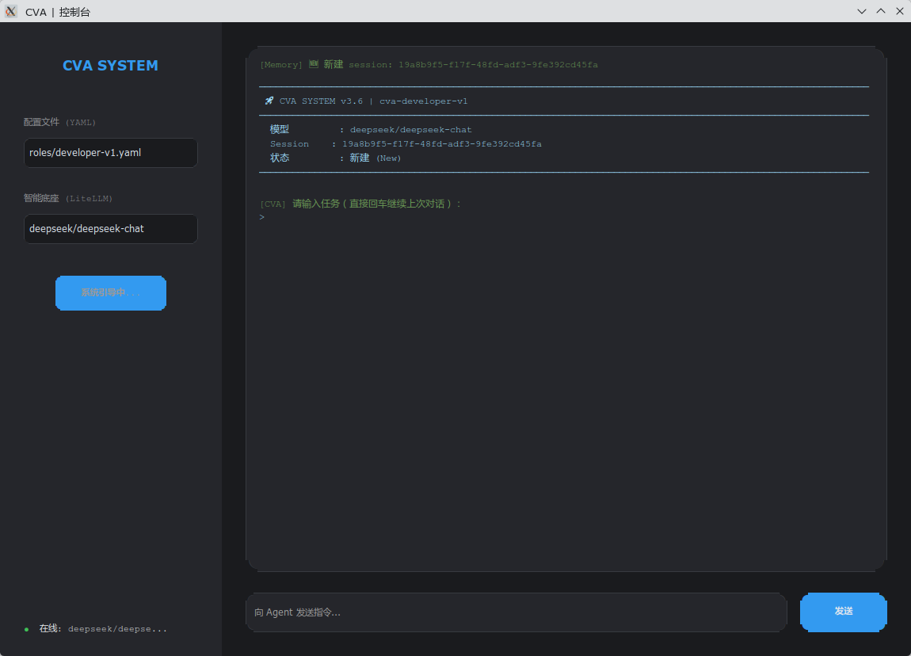

# 🚀 受控百变智能体 (CVA，Controlled Versatile Agent)

### —— 归还大脑以自由，赋予底座以枷锁。

[](LICENSE)
[](https://www.python.org/)
[](https://github.com/7415069/Controlled-Versatile-Agent)

<p align="center">
  
</p>

<br>

## 🚩 宣言：智能，不应是预设的剧本

在 Agent 概念喧嚣的今天，我们遗憾地看到，大量所谓的“智能体”正沦为**披着 AI 外衣的传统自动化脚本**。

开发者们小心翼翼地预设了一套套 SOP（标准作业程序），在固定的节点调用大模型进行“填空”。这种做法虽然在特定场景下有效，但却在无形中阉割了大模型最珍贵的特质：**自主规划与动态适配的能力**。

**CVA 认为：**

* **智能不应被“喂养”**：如果一个 Agent 的能力边界取决于程序员写了多少行 `if-else`，那它只是一个高级的宏程序。
* **底座应是“无相”的**：底座不应包含任何业务逻辑，它只需提供受控的权限、持久的记忆和原子化的工具。
* **大脑是唯一的驱动**：只要 Token 足够充裕，模型足够聪明，人类只需指明终点，路径应由大脑在数字世界中自行开辟。

---

## 🧐 那些被“剧本”束缚的时刻

当现实的需求稍稍偏离了开发者预设的轨道，那些“伪智能体”往往会显露出其逻辑的底色：

* **当“地图”消失时**：面对一个从未见过的私有协议或文件格式，预设了 `ls` 和 `cat` 的 Agent 会陷入无尽的报错循环。因为它在等待人类为它更新“插件”，而不是思考如何自制一把钥匙。
* **当“路径”受阻时**：在长程任务中，环境是瞬息万变的。死守 Step 1 到 Step N 的 Agent，在第一步出错时就会满盘皆输。真正的智能，应如水之无常形，在每一轮迭代中自省、反思并重绘蓝图。
* **当“自由”与“安全”冲突时**：为了安全，我们往往选择禁锢。但禁锢了操作，也禁锢了可能。我们需要的不是一个被锁在笼子里的打字员，而是一个在执行高危操作前，懂得停下来向你阐述理由并申请“提权”的数字合伙人。

---

## 🧠 CVA 设计哲学：大脑驱动一切

CVA 重新定义了 Agent 的架构，将其拆解为两个极端的平衡：

### 1. 极简且坚固的“通用底座” (Universal Shell)

底座退化为纯粹的“物理法则”。它不关心任务是写代码还是运维，它只负责：

* **原子工具集**：提供文件、网络、进程等最基础的“手”和“眼”。
* **安全边界 (Security Boundary)**：基于模式匹配与动态审计的权限护城河。
* **全程审计 (Audit Log)**：记录大脑的每一次呼吸（思考）与动作。

### 2. 100% 外置的“智能驱动”

* **主动实施**：模型不再是被动问答，而是任务的主动执行者。
* **自我进化 (Self-Evolution)**：通过 `synthesize_tool`，模型在发现现有工具不足时，可自主编写 Python 工具并即时热加载。
* **语义脱水 (Memory Dehydration)**：通过提取代码骨架，让大脑在极小的 Token 消耗下，依然能维持对复杂工程的全局记忆。

---

## 🥊 巅峰对决：思想层级的博弈

在 Agent 的进化之路上，CVA 与工业界巨头有着截然不同的取向：

| 维度       | **Anthropic MCP / Claude Skills**   | **OpenClaw**                       | **CVA**                                  |
|:---------|:------------------------------------|:-----------------------------------|:-----------------------------------------|
| **核心本质** | **标准化的“喂食器”**                       | **数字世界的“打字员”**                     | **自主进化的“数字人”**，不再是 NPC                   |
| **工具获取** | **静态施舍**。必须由人类先写好 Server，AI 才能获得技能。 | **指令预设**。依赖预定义的 UI 操作指令集。          | **动态合成**。大脑意识到工具缺失，**现场写代码造工具**并原地进化。    |
| **逻辑边界** | **接口填空**。模型在人类给定的“技能池”里跳舞。          | **视觉驱动**。在繁琐的 UI 截图与点击中消耗大量 Token。 | **逻辑零硬编码**。底座无逻辑，路径全靠大脑实时计算。             |
| **权限模型** | **静态开关**。缺乏细粒度的动态提权与实时审计。           | **高危裸奔**。为了操作便利，往往牺牲了安全边界。         | **动态提权 (Escalation)**。高危操作必带理由申请，人类实时把关。 |
| **长程记忆** | **滑动窗口**。任务稍长即“断片”，丢失架构级视野。         | **线性逻辑**。容易迷失在 UI 细节中，忘记最初目标。      | **语义脱水**。自动压缩历史，保留架构骨架，支持超长任务。           |
| **长程任务成功率** | 依赖人类补插件 | 易在 UI 迷失 | **92%+（含 10+ 轮自进化）**                     |

> **NPC 遵循剧本，而数字人创造未来。** 当环境发生变化，NPC 还在等待程序员更新补丁，而 CVA 已经写好了自己的进化代码。
---

## 🛠️ 核心功能亮点

* **🛡️ 动态权限提权 (Escalation Manager)**：首创 Agent 提权机制。当模型触碰敏感路径或高危命令时，会自动挂起任务，向人类发起带理由的申请。
* **📉 智能记忆脱水 (Memory Store)**：当对话过长时，系统自动将旧代码内容“脱水”成语义骨架（类名、函数签名），既保留了架构记忆，又节省了 90% 的 Token。
* **🧬 工具合成引擎 (Synthesize Tool)**：业界首创现场 Python 类生成 + 热加载，模型发现工具缺失即可原地进化，无需人类干预。
* **🕵️ 全程审计日志 (Audit Log)**：每一轮思考、每一个工具调用、每一次权限变更，全部结构化记录，确保 Agent 的行为可追溯、可审计。

---

## 🚀 快速开始

### 1. 环境准备

```bash
git clone https://github.com/7415069/Controlled-Versatile-Agent
pip-compile --no-emit-index-url --no-emit-trusted-host requirements.in
pip install -r requirements.txt
```

### 2. 定义角色

在 `roles/` 目录下通过 YAML 定义你的角色。只需指明身份和初始权限，**严禁写入任何业务逻辑**。

### 3. 唤醒大脑

```bash
# 启动深色 IDE 风格的 GUI 控制台
python cv_agent.py

# 或者启动纯净的 CLI 模式
python -m core.shell --manifest roles/developer-v1.yaml
```

---

## 🤝 结语

如果您也厌倦了那些被预设逻辑束缚的“智能体”，欢迎加入 CVA。

**CVA 的信条：底座越简单，智能越纯粹。**

我们不教 AI 如何思考，我们只给它一个可以被它完全操纵的数字物理世界。

---

**CVA：给大脑以自由，给底座以枷锁。**