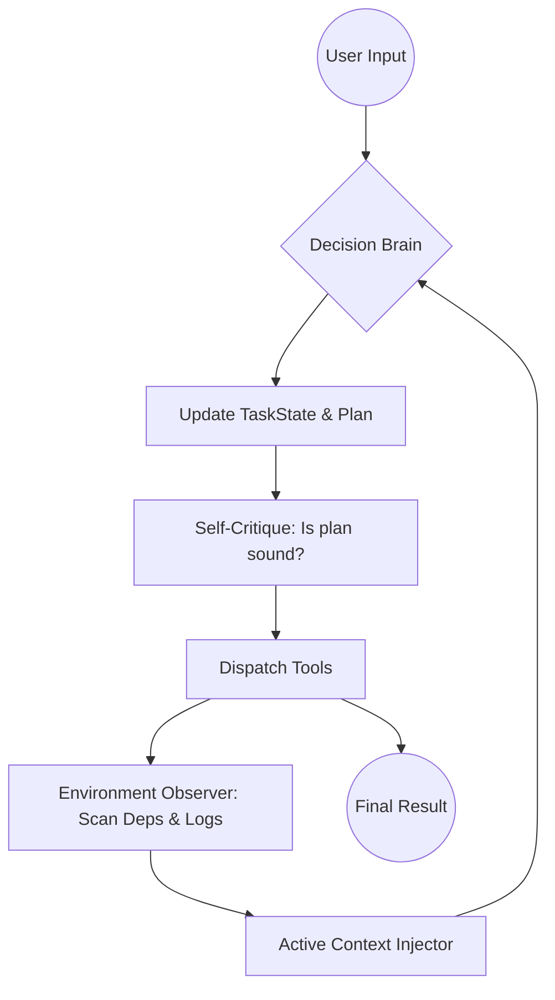

# CVA 进化设计文档：从执行器到自治智能体 (Autonomous Agent)

## 1. 核心设计哲学
*   **状态化 (Stateful)：** 摆脱单一的线性对话流，维护一份结构化的任务状态机。
*   **深思考 (Reasoning-First)：** 强制推行“先思考、再工具、后自省”的认知循环。
*   **主动性 (Proactivity)：** 底座不再被动等待指令，而是根据代码依赖关系主动推送上下文。

---

## 2. 模块增强方案

### 2.1 认知架构：引入“活跃状态机” (Active State Machine)
**现状：** 模型依赖 `MemoryStore` 中的历史对话来找回状态，Token 消耗大且易幻觉。
**增强：** 在 `MemoryStore` 中新增 `TaskState` 类，作为 Agent 的“短期意识”。

*   **数据结构 (State.json):**
    ```json
    {
      "current_goal": "修复 Auth 模块的 JWT 过期漏洞",
      "plan": ["定位代码", "编写测试用例", "修复逻辑", "验证"],
      "completed_steps": ["定位代码"],
      "discovered_knowledge": {
        "auth_logic": "位于 core/auth.py, 使用 pyjwt 库",
        "key_location": "存储在 .env 的 JWT_SECRET"
      },
      "assumptions": ["假设当前测试失败是因为时区不一致"],
      "pending_risks": ["修改 auth.py 可能会影响 escalation.py 的调用"]
    }
    ```
*   **工作流优化：** 每轮迭代，`UniversalShell` 会自动将该 JSON 对象置于 System Prompt 之后。Agent 的 `SubmitPlanTool` 不再仅仅是备案，而是直接修改这个状态机。

### 2.2 推理增强：引入“自省循环” (Critique Loop)
**现状：** 模型生成错误代码后，直接返回给用户，等待人类纠错。
**增强：** 修改 `UniversalShell._run_loop`，增加 **Internal Monologue (内部独白)**。

*   **设计模式：**
    1.  **Draft 阶段：** 模型生成初步方案或代码。
    2.  **Critique 阶段（隐藏）：** 底座自动调用一个轻量级 Prompt：“检查上述方案是否存在逻辑漏洞、路径越权或安全隐患”。
    3.  **Refine 阶段：** 模型根据自省建议修正后，再执行工具或输出给用户。
*   **实现建议：** 在 `LLMAdapter` 中增加 `thought_process` 字段支持（类似 OpenAI o1 的 reasoning_tokens）。

### 2.3 记忆进化：语义脱水 2.0 (Semantic Importance Pruning)
**现状：** 基于消息位置（最后 N 条）的粗暴脱水。
**增强：** 引入 **“重要性评分 (Importance Score)”**。

*   **算法逻辑：**
    *   **Level 0 (永远保留)：** `submit_plan` 的最新结果、关键变量定义、人类的明确指令。
    *   **Level 1 (骨架化)：** 已读过的大段代码（转为 Skeleton）。
    *   **Level 2 (完全压缩)：** 之前的报错 Traceback（仅保留报错原因一行）、重复的 `list_directory` 输出。
*   **实现：** 在 `MemoryStore.append` 时，利用 LLM 对该条消息标记标签 `[DECISION]`, `[PROCESS]`, `[NOISE]`。

### 2.4 环境感知：主动上下文注入 (Active Context Injection)
**现状：** 模型必须手动调用 `get_file_skeleton` 才能看到依赖文件。
**增强：** 建立 **“符号依赖热图”**。

*   **技术实现：**
    1.  当 `ReadFileTool` 被调用时，底座在后台用正则表达式快速扫描 `import` 和 `require`。
    2.  如果发现 A 引用了 B，底座自动将 B 的 `FileSkeleton` 放入“感知区（Perception Area）”。
    3.  **注入机制：** 在下一轮输入中，底座主动加入一条：`[底座提示]：检测到你正在处理的 A 依赖 B 文件的 C 函数。为了辅助你思考，我已主动加载 B 的骨架如下...`
*   **意义：** 赋予 Agent “眼观六路”的直觉。

---

## 3. 工具层进化 (Tool Layer 3.0)

### 3.1 引入元工具 (Meta-Tools)
*   **`research_topic`：** 这是一个组合工具。当模型不明白某个库怎么用时，底座自动并发调用 `search_files` + `http_request` (查文档) + `grep`，最后总结一份“研究报告”给模型。
*   **`verify_fix`：** 强制闭环。模型修复代码后，底座强制其必须运行一个测试任务（Python 脚本或 Shell 命令），只有测试通过，任务才算 `stop`。

### 3.2 支持 MCP 协议 (Model Context Protocol)
*   将 `core/tool.py` 封装为 MCP 接口，允许 CVA 作为一个 **Context Server**。
*   **好处：** 你的 CVA 以后不仅能改代码，还能直接读用户的 Jira 任务、查 Slack 讨论记录，甚至操作数据库，所有的上下文管理逻辑都是复用的。

---

## 4. 进化版流程图 (Architecture Roadmap)



---

## 5. 实施路线图 (Phase-in Plan)

1.  **第一阶段 (1-2周)：**
    *   在 `MemoryStore` 中实现结构化的 `TaskState`。
    *   修改 `developer-v1.yaml`，通过 Prompt 强制要求模型每一轮更新状态。
2.  **第二阶段 (2-4周)：**
    *   实现 `UniversalShell` 的“隐藏自省步骤”。
    *   升级 `permissions.py`，支持基于依赖图谱的动态预判。
3.  **第三阶段 (1个月后)：**
    *   全面接入 MCP 协议，实现跨应用的主动上下文抓取。

---

## 6. 关键代码改动建议 (伪代码)

**shell.py:**
```python
def _run_loop(self):
    while self._iteration < self._max_iterations:
        # 1. 注入当前状态机 (Active State Machine)
        state_context = self._memory.get_current_state()
        
        # 2. 推理阶段 (Reasoning)
        response = self._llm.chat(..., extra_system=f"Current State: {state_context}")
        
        # 3. 增加“思考”步骤的解析
        if "[THOUGHT]" in response.text:
            self._handle_internal_monologue(response.text)
            
        # 4. 执行并观察 (Observe)
        results = self._dispatch_tool(response.tool_calls)
        
        # 5. 主动感知 (Active Perception)
        extra_info = self._perception_engine.scan(results)
        self._memory.append_perception(extra_info)
```

**memory.py:**
```python
class TaskState:
    def update(self, new_plan_json):
        # 逻辑：对比旧计划，发现偏离时在下一轮给予警告
        pass

def prepare_for_llm(self):
    # 逻辑：不再只看 N 条，而是看消息的 [Importance_Score]
    # Decision 消息永久保留，Noise 消息立即脱水
```
